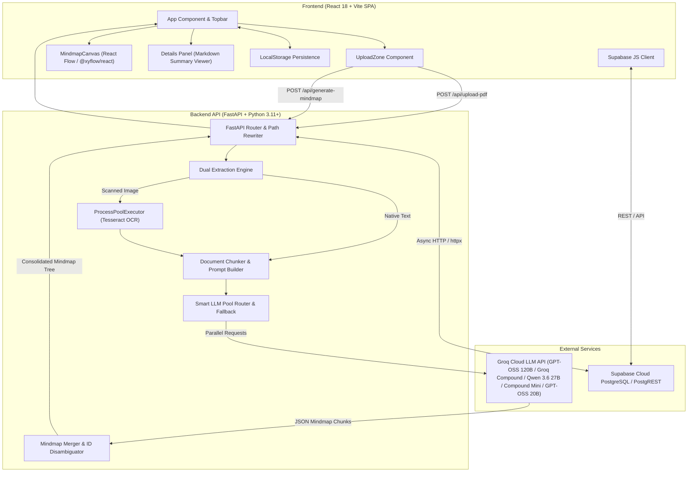
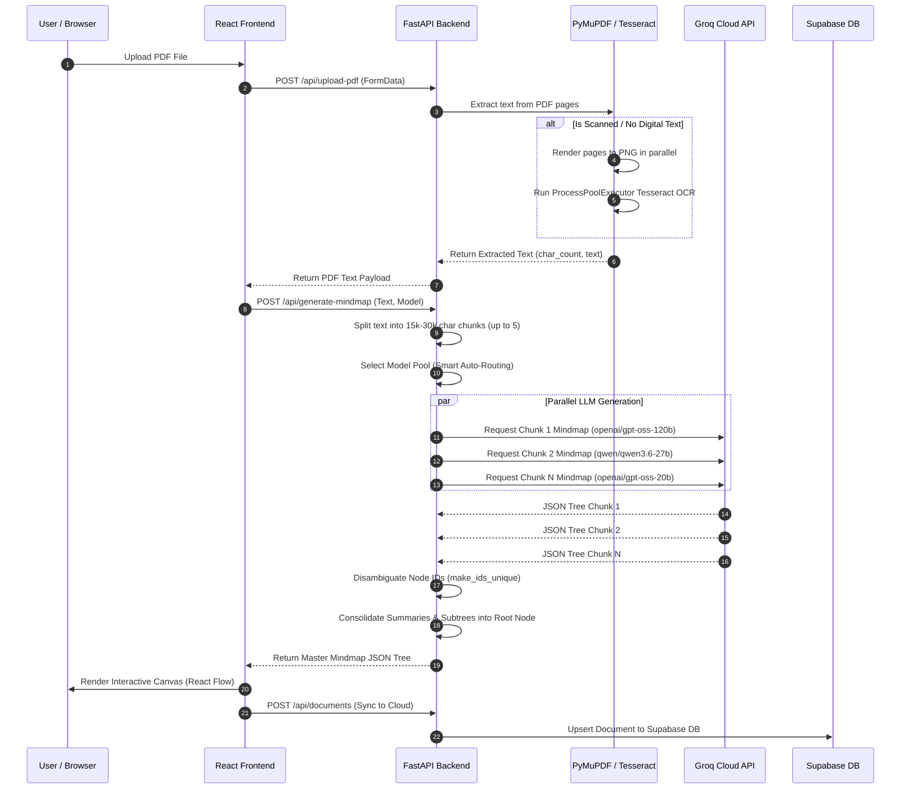

# Architecture Documentation: PDF-to-Mindmap Study Application

## 1. Executive Overview & Mission Statement

The **PDF-to-Mindmap Study Application** is an ADHD-friendly, high-substance educational platform designed to transform long-form academic documents, research papers, and textbooks into structured, interactive mindmaps and cognitive study guides.

### Core Objectives
1. **Cognitive Accessibility & Distraction Reduction**: Address cognitive overload through progressive disclosure (expand/collapse tree branches), single-branch Focus Mode, and structured summaries (Core Concept, Examples, Connection).
2. **Dual-Layer PDF Extraction**: Process both native digital PDFs and scanned image-based PDFs seamlessly using PyMuPDF and multi-threaded parallel Tesseract OCR.
3. **Distributed Multi-Model LLM Routing**: Mitigate rate limits (TPM/RPM) and optimize inference performance via Groq Cloud API model pooling, parallel document chunking, and smart auto-routing.
4. **Resilient Dual Storage & Hybrid Auth**: Provide zero-friction local-first functionality with instant offline fallback alongside Supabase Cloud synchronization and authentication.

---

## 2. System Architecture Overview

### High-Level Architecture Diagram



### PDF Processing & LLM Inference Sequence Diagram



---

## 3. Frontend Architecture & UI/UX Stack

### Technology Stack
* **Framework**: React 18 with Vite & TypeScript
* **State & Flow Graph**: `@xyflow/react` (React Flow v12)
* **Styling**: Tailwind CSS (Minimalist, slate/blue palette, high contrast, clean boundaries)
* **Icons**: `lucide-react`
* **Authentication**: `@supabase/supabase-js`

### Key Frontend Components

#### 1. `App.tsx` (Root Controller)
* **State Management**: Controls `currentUserEmail`, `documents`, `activeDocId`, `expandedIds`, `selectedNode`, `isFocusMode`, `selectedModel`, and `undoHistory`.
* **Hybrid Storage & Hydration**: Automatically hydrates user documents from Supabase upon login; falls back to `localStorage` when offline or when database configuration is missing.
* **Authentication Flow**: Supports Sign In, Sign Up, Password Recovery, and Guest/Instant mode.

#### 2. `MindmapCanvas.tsx` (Interactive Graph Rendering Engine)
* **Custom Node Component (`FlatCustomNode`)**: Custom React Flow node rendering scannable labels (3-5 words max), expand/collapse (`+` / `−`) action buttons, and source/target handles.
* **Dynamic Tree Layout Algorithm (`layoutTree`)**:
  * Calculates node coordinates recursively without relying on heavy external layout packages.
  * **Horizontal Offset**: Parent nodes at $X=40$, children at $X=320$, grandchildren at $X=600$ (horizontal step $\Delta X = 280\text{px}$).
  * **Vertical Midpoint Balancing**: Calculates bounding height for all expanded children subtrees and centers parent nodes vertically relative to child midpoints.
  * **Edge Connections**: Renders `smoothstep` routing curves between nodes (`#cbd5e1`, $1.5\text{px}$ width).

#### 3. `UploadZone.tsx` (Drag-and-Drop Uploader)
* Drop zone for PDF files with real-time multistage progress indicators (Extraction $\rightarrow$ Structuring $\rightarrow$ Rendering).
* Displays model execution metadata (e.g., smart routing model notifications, multi-model pool distribution alerts).

#### 4. Details Panel & Markdown Parser (`parseSummaryText`)
* Slide-out panel presenting detailed node information.
* Parses rigid Markdown structures into structured visual components:
  * `### Core Concept`: 1-2 sentence core factual explanation.
  * `### Examples`: Bulleted concrete examples/case studies.
  * `### Connection`: Conceptual link back to parent topic.

---

## 4. Backend Architecture & API Specifications

### Technology Stack
* **Framework**: FastAPI (Python 3.11+)
* **ASGI Server**: Uvicorn (`uvicorn main:app --port 8000`)
* **PDF Engines**: PyMuPDF (`fitz`), `pypdf`, `pytesseract` (Tesseract OCR), `PIL` (Pillow)
* **Async HTTP & Parallelism**: `httpx.AsyncClient`, `asyncio.gather`, `concurrent.futures.ProcessPoolExecutor`

### Core Backend Processing Pipelines

#### 1. Dual PDF Extraction Pipeline (`/api/upload-pdf`)
1. **Digital Text Probe**: Reads PDF stream with PyMuPDF (`fitz.open`). Iterates over pages and extracts digital text strings.
2. **OCR Fallback & Process Pool**: If no digital text is found ($<50$ chars per page), converts PDF pages to 120 DPI PNG byte images and spawns a `ProcessPoolExecutor` utilizing available CPU cores (`min(page_count, cpu_count)`) to run Tesseract OCR in parallel.
3. **Character Truncation Safety**: Limits extracted text output to 100,000 characters to prevent LLM context window overflow.

#### 2. Distributed LLM Inference Engine (`/api/generate-mindmap`)
* **Chunking Engine (`split_text_into_chunks`)**: Splits document text at logical sentence/paragraph boundaries into chunks of 15,000 to 30,000 characters (max 5 chunks).
* **Equal Load Balancing & Model Pools**:
  * **Flagship & Large Models**: `openai/gpt-oss-120b`, `groq/compound`, `qwen/qwen3.6-27b`.
  * **Fast & High-Throughput Models**: `groq/compound-mini`, `openai/gpt-oss-20b`.
  * **Equal Load Balancing Strategy**: All document chunks and independent generation requests are dynamically striped in an atomic round-robin sequence across all 5 models (`openai/gpt-oss-120b`, `groq/compound`, `qwen/qwen3.6-27b`, `groq/compound-mini`, `openai/gpt-oss-20b`), ensuring each model handles exactly 20% of the inference volume and preventing single-model rate limits.
* **Non-Backtracking JSON Sanitization (`clean_json_string`)**: Uses fast string index locating (`find('{')` and `rfind('}')`) to extract valid JSON objects without encountering catastrophic regex backtracking on massive payloads.
* **Exponential Backoff & Rate Limit Handling**: Detects HTTP `429` status codes and Groq TPM error responses; automatically retries up to 3 times with exponential backoff and randomized jitter.
* **Mindmap Tree Consolidation (`consolidate_summaries` & `make_ids_unique`)**: Suffixes node IDs for each chunk (`part_1`, `part_2`...) to guarantee key uniqueness in React Flow, then attaches all sub-map roots under a master root node.

### REST API Route Reference

| Endpoint | Method | Payload / Query | Description |
| :--- | :--- | :--- | :--- |
| `/api/health` | `GET` | N/A | Health check endpoint returning backend status & OpenRouter/Groq config state. |
| `/api/auth/config` | `GET` | N/A | Exposes Supabase URL and Anon/Public Key for frontend initialization. |
| `/api/upload-pdf` | `POST` | `multipart/form-data` (`file`) | Extracts text from uploaded PDF using PyMuPDF or parallel Tesseract OCR. |
| `/api/generate-mindmap` | `POST` | `{"text": string, "model": string}` | Generates structured mindmap JSON via Groq multi-model inference. |
| `/api/documents` | `GET` | `?email=user@example.com` | Fetches saved documents for a specific user from Supabase DB. |
| `/api/documents` | `POST` | `DocumentSavePayload` | Saves/upserts a document to Supabase database. |
| `/api/documents/{doc_id}` | `DELETE` | `?email=user@example.com` | Deletes a document owned by the specified email. |
| `/api/documents/reset/workspace` | `DELETE` | `?email=user@example.com` | Deletes all saved documents for a user workspace. |

---

## 5. Database & Cloud Synchronization

### Database Schema (Supabase PostgreSQL)

```sql
CREATE TABLE public.documents (
    id UUID PRIMARY KEY,
    user_email TEXT NOT NULL,
    name TEXT NOT NULL,
    data JSONB NOT NULL,
    created_at TIMESTAMP WITH TIME ZONE DEFAULT timezone('utc'::text, now()) NOT NULL
);

-- Index for fast user workspace lookups
CREATE INDEX idx_documents_user_email ON public.documents(user_email);
```

### Hybrid Sync Architecture
* **PostgREST Integration**: Backend interacts directly with Supabase PostgREST endpoints using `httpx.AsyncClient` with `Prefer: resolution=merge-duplicates` headers for seamless upsert operations.
* **Local-First Fallback**: If network connectivity fails or database credentials are unavailable, the application stores mindmaps in `localStorage` without interrupting user workflow.

---

## 6. Deployment & Environment Configuration

### File Structure Topology

```
PDF-to-Mindmap/
├── ARCHITECTURE.md          # Full Architecture Documentation
├── handoff.md               # Session continuity handoff log
├── build.sh                 # Production build script
├── start.sh                 # Local development launcher script
├── package.json             # Root NPM script definitions
├── vercel.json              # Vercel serverless deployment routing config
├── backend/
│   ├── main.py              # FastAPI application server & endpoints
│   ├── requirements.txt     # Python backend dependencies
│   ├── .env                 # Environment variables configuration
│   └── server.log           # Development server output logs
└── frontend/
    ├── package.json         # React dependencies (Vite, React Flow, Supabase)
    ├── vite.config.ts       # Vite bundler configuration
    ├── tailwind.config.js   # Tailwind CSS styling tokens
    └── src/
        ├── App.tsx          # Main React Application & State Controller
        ├── main.tsx         # React DOM root entrypoint
        └── components/
            ├── MindmapCanvas.tsx  # Interactive canvas & auto-layout algorithm
            ├── UploadZone.tsx     # PDF drag & drop upload component
            └── Toast.tsx          # User alert toast notification system
```

### Deployment Configuration (`vercel.json`)
Configured for serverless deployment on Vercel:
* Frontend Vite SPA mapped to `/` route.
* FastAPI backend entrypoint (`main.py`) mapped to `/api` route.

### Key Environment Variables
* `GROQ_API_KEY`: API key for Groq Cloud LLM acceleration.
* `SUPABASE_URL`: Supabase project URL.
* `SUPABASE_KEY` / `SUPABASE_ANON_KEY`: Supabase API access keys.

---

## 7. Security, Rate Limiting & System Resilience

1. **Path Traversal Protection**: FastAPI catch-all static route strictly resolves absolute paths and verifies target files remain inside `frontend/dist`.
2. **TPM Rate Limit Bypass**: Multi-chunk document processing and individual requests dynamically distribute load equally across 5 active model pools (`openai/gpt-oss-120b`, `groq/compound`, `qwen/qwen3.6-27b`, `groq/compound-mini`, `openai/gpt-oss-20b`), keeping per-model token requests well within free-tier rate limits.
3. **Structured Response Safeguards**: Prompts enforce JSON schema outputs. `clean_json_string` guarantees valid JSON parsing even when LLMs enclose output in Markdown code blocks or preamble conversational text.
4. **React Flow Memory Safety**: Automatic node ID disambiguation (`make_ids_unique`) prevents duplicate key rendering collisions in the DOM during tree manipulation.
